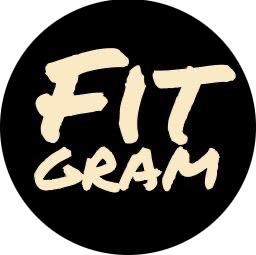

 

<h4 align="center">Приложение для Android, созданное в качестве дипломного проекта в онлайн - университете GeekBrains</h4>

## Над проектом работали: 

 -  _Олег_  [@Mys_ya](https://t.me/Mys_ya) -  `автор идеи`, `разработчик`
 -  _Ильнур_ [@Nelson_Thunder](https://t.me/Nelson_Thunder) -  `разработчик`
 -  _Александр_ [@ZoerAleksandr](https://t.me/ZoerAleksandr) -  `разработчик`
 
 ## Функционал приложения: 
  - Авторизация 
  - Создание расписания тренировок
  - Создание собственных тренировок и упражнения
  - Выбор цели тренировок
  - Рассчет нормы каллорий
  
 ## Необходимо сделать:
  - Режим выполнения тренировки
  - Возможность отправить план тренировок другому пользователю
  - Изпользовать приложения Камера для создания аватара пользователя
 
 ## Язык - Kotlin
 
 ## Архитектура - MVVM
 
 ## Стек технологий:
  - XML
  - Room
  - Coroutines
  - Koin
  - Coil
  - Jetpack Navigation
  - Firebase
  
 ## Пример работы приложения

